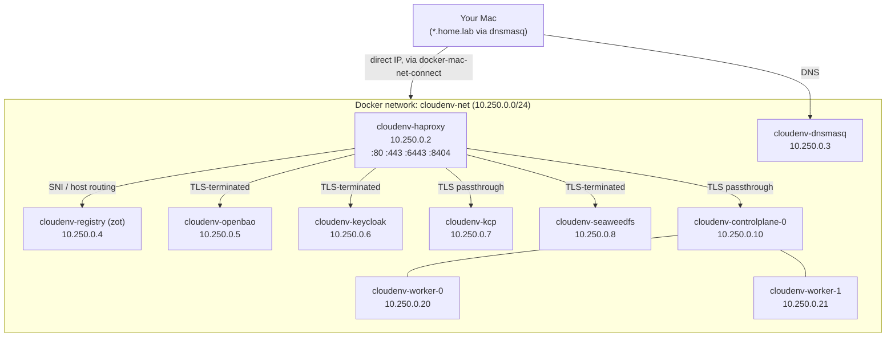

# CloudEnv

CloudEnv spins up a fully local, Docker-based Kubernetes environment for development and testing — a Talos cluster plus the supporting infrastructure (ingress, DNS, container registry, secrets, identity, and a `kcp` control plane) you'd normally need separate cloud accounts for. Everything is provisioned with OpenTofu and driven through a handful of `just` recipes.

## Architecture



Talos nodes run *as Docker containers* (not VMs) with real `containerd`/kubelet inside, giving you a genuine multi-node Kubernetes cluster without a hypervisor. HAProxy is the single ingress point, terminating TLS with a locally-trusted [mkcert](https://github.com/FiloSottile/mkcert) certificate; `dnsmasq` resolves `*.home.lab` to it. Flux runs GitOps-style, pushing this repo's `manifests/` folder as an OCI artifact to the local registry instead of requiring a real git remote.

## Prerequisites

- **Docker Desktop** — running, with enough resources for a 3-node cluster
- **[Devbox](https://www.jetify.com/devbox)** — provisions every CLI tool used below (`kubectl`, `helm`, `kustomize`, `k9s`, `opentofu`, `flux`, `talosctl`, `just`, `mkcert`) via `devbox.json`; no manual installs needed
- **[direnv](https://direnv.net/)** (optional but recommended) — auto-loads the devbox shell and exports `KUBECONFIG`/`TALOSCONFIG`/`KUBECONFIG_KCP` on `cd`; see [.envrc](.envrc)
- **macOS**: [docker-mac-net-connect](https://github.com/chipmk/docker-mac-net-connect) — routes the host directly to the Docker bridge network so you can reach container IPs (`10.250.0.x`) without publishing every port individually

### DNS setup (required once)

Every service is reached at `<name>.home.lab`. Point that domain at the local `dnsmasq` container:

```shell
just setup-dns
```

This writes `/etc/resolver/home.lab` so macOS forwards `*.home.lab` queries to `dnsmasq` (`10.250.0.3`), which in turn resolves everything to HAProxy.

## Quick start

```shell
devbox shell        # or let direnv load it automatically
just up              # provision network, certs, registry, cluster, Flux, etc.
just status           # kubectl cluster-info
just k9s               # browse the cluster
```

```shell
just down             # destroy the cluster (containers, volumes, network)
just reset             # down + wipe .configs/, .data/, and local tofu state
```

## Services

| Service | Address | Notes |
|---|---|---|
| Kubernetes API | `https://kube.cloudenv.home.lab:6443` | also reachable directly at the control-plane IP printed by `just up` |
| Container registry ([zot](https://zotregistry.dev)) | `https://registry.home.lab` | OCI/Docker v2 API, optional pull-through mirroring |
| OpenBao (Vault-compatible) | `https://openbao.home.lab` | dev-mode, root token from `openbao_root_token` (default `root`) |
| Keycloak | `https://keycloak.home.lab` | dev-mode, admin login from `keycloak_admin_password` (default `admin`/`admin`) |
| kcp | `https://kcp.home.lab:6443` | TLS passthrough — kcp terminates its own TLS |
| SeaweedFS master UI | `https://s3.home.lab` | S3-compatible object storage admin UI |
| SeaweedFS S3 API | `http://<seaweedfs-ip>:8333` | reach directly by container IP (not proxied through HAProxy); credentials from `seaweedfs_s3_access_key`/`seaweedfs_s3_secret_key` (default `seaweedfs`/`seaweedfs-secret`) |
| HAProxy stats | `http://<host>:8404` | published directly on the host |

> ⚠️ **OpenBao, Keycloak, kcp, and SeaweedFS all run in dev/ephemeral-storage modes.** Data does not survive `just reset` (and in OpenBao/Keycloak's case, not even a container restart). This environment is for testing, not for anything you need to keep.

## Configuration

Cluster shape and credentials are set in [terraform/local-talos.tfvars](terraform/local-talos.tfvars) — see [terraform/variables.tf](terraform/variables.tf) for the full list (worker/control-plane counts, Talos/Kubernetes versions, domain, Flux git settings, service credentials). Change the file and re-run `just up`.

### Kubeconfigs

`just up` writes everything under `.configs/`:

| File | Env var | Purpose |
|---|---|---|
| `.configs/kubeconfig` | `KUBECONFIG` | the Talos cluster |
| `.configs/talosconfig` | `TALOSCONFIG` | `talosctl` access to the nodes |
| `.configs/kcp-kubeconfig` | `KUBECONFIG_KCP` | the kcp control plane |

## GitOps with Flux

Flux is installed by default (`enable_flux = true`). With no `flux_git_url` configured, it runs git-less: this repo's `manifests/` directory is pushed as an OCI artifact to the local registry, and Flux reconciles from there via an `OCIRepository` + `Kustomization` — no external git server required. Set `flux_git_url` in your `.tfvars` to bootstrap against a real git repo instead.

`manifests/apps/podinfo` ships as a working example (`OCIRepository` + `HelmRelease` sourcing podinfo's chart directly from `ghcr.io`).

## Repository layout

```
terraform/
  main.tf, variables.tf, outputs.tf   # root module — wires everything together
  local-talos.tfvars                  # your cluster configuration
  modules/
    network/       docker network
    certificates/  mkcert-issued wildcard cert + root CA
    cluster/       Talos nodes (docker containers) + bootstrap
    haproxy/       ingress: TLS termination + passthrough routing
    dnsmasq/       *.home.lab → haproxy
    registry/      zot OCI/Docker registry
    openbao/       Vault-compatible secrets engine (dev mode)
    keycloak/      identity provider (dev mode)
    kcp/           kcp control plane
    seaweedfs/     S3-compatible object storage (SeaweedFS)
    flux/          Flux install + git-less OCI sync
manifests/
  apps/podinfo/    example Flux-managed app
  base/, overlays/ plain kustomize manifests (kubectl apply -k)
.configs/          generated kubeconfigs (gitignored)
.data/             rendered configs, TLS material, mkcert certs (gitignored)
```

## Troubleshooting

- **`just up` fails with connection/TLS errors to `*.home.lab`** — run `just setup-dns`, and confirm `docker-mac-net-connect` is running (`sudo brew services info docker-mac-net-connect`).
- **A service's HAProxy backend fails to start / config parse error** — HAProxy validates that every backend name (cluster names, registry names, `openbao`/`keycloak`/`kcp`) is unique; `tofu plan` will fail fast with a clear error if two collide.
- **Terraform provisioner didn't pick up a script change** — `terraform_data` resources only rerun when their `triggers_replace` changes; each one hashes its script file, so editing e.g. `modules/kcp/scripts/extract-kubeconfig.sh` triggers a rerun automatically on the next `just up`.

